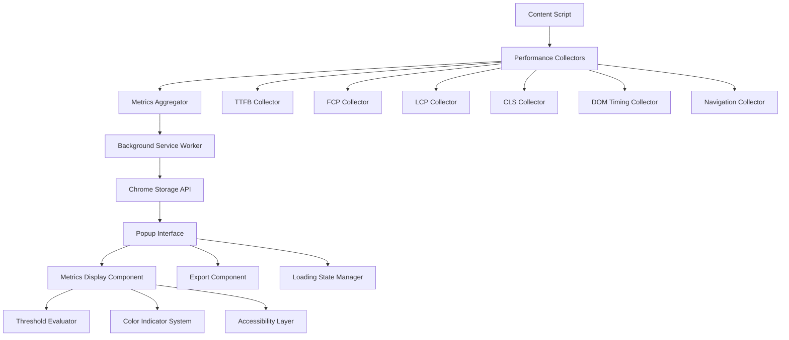

# Design Document

## Overview

This design document outlines the architecture for enhancing the existing Chrome Extension to provide comprehensive Core Web Vitals assessment. The solution builds upon the current Manifest V3 architecture while adding robust CLS measurement, improved SPA detection, color-coded thresholds, JSON export functionality, and enhanced accessibility features.

The design leverages Chrome's Performance Observer API, Web Vitals library integration, and implements a sophisticated state management system to handle dynamic content updates and SPA navigation patterns.

## Architecture

### High-Level Architecture



### Component Architecture

The extension follows a modular architecture with clear separation of concerns:

1. **Content Script Layer**: Collects performance metrics using Performance Observer API
2. **Background Service Worker**: Manages data persistence and tab-specific state
3. **Popup Interface**: Displays metrics with accessibility features and export functionality
4. **Metrics Processing**: Evaluates thresholds and manages real-time updates

## Components and Interfaces

### 1. Performance Metrics Collector (Enhanced Content Script)

**Purpose**: Collect all Core Web Vitals metrics with support for dynamic content and SPA navigation.

**Key Interfaces**:

```javascript
interface MetricsCollector {
  collectInitialMetrics(): Promise<PerformanceMetrics>
  observeContinuousMetrics(): void
  handleSPANavigation(): void
  resetMetricsState(): void
}

interface PerformanceMetrics {
  TTFB: number
  FCP: number
  LCP: number
  CLS: number
  DOMLoadTime: number
  NavigationTime: number
  timestamp: number
  url: string
  transitionType: 'navigation' | 'spa'
  lastUpdated: number
}
```

**Enhanced Features**:

- **CLS Observer**: Continuous monitoring using PerformanceObserver for layout-shift entries
- **SPA Detection**: Enhanced URL change detection with History API monitoring
- **Dynamic Content Handling**: MutationObserver integration for content changes
- **Threshold-based Updates**: Smart update frequency based on metric stability

### 2. Threshold Evaluation System

**Purpose**: Evaluate metrics against Google's Core Web Vitals thresholds and provide color coding.

**Thresholds Configuration**:

```javascript
const CWV_THRESHOLDS = {
  FCP: { good: 1.8, needsImprovement: 3.0 },
  LCP: { good: 2.5, needsImprovement: 4.0 },
  CLS: { good: 0.1, needsImprovement: 0.25 },
  TTFB: { good: 0.8, needsImprovement: 1.8 }
}

interface ThresholdResult {
  status: 'good' | 'needs-improvement' | 'poor'
  color: 'green' | 'orange' | 'red'
  accessible_indicator: string
}
```

### 3. Enhanced Popup Interface

**Purpose**: Display metrics with accessibility features, color coding, export functionality, and visual debugging tools.

**Key Components**:

- **Metrics Display Grid**: Clean table layout with proper ARIA labels
- **Loading State Manager**: Sophisticated loading indicators with progress feedback
- **Export Manager**: JSON export with clipboard integration
- **CLS Visual Debugger**: Toggle button to highlight layout shift sources on the page
- **Accessibility Layer**: Screen reader support and keyboard navigation

**Interface Structure**:

```javascript
interface PopupInterface {
  renderMetrics(metrics: PerformanceMetrics): void
  showLoadingState(progress?: number): void
  exportAsJSON(): Promise<void>
  updateTimestamp(): void
  highlightChangedMetrics(changedFields: string[]): void
  toggleCLSHighlighting(): void
  showCLSDebugger(): void
}
```

### 4. SPA Navigation Handler

**Purpose**: Detect and handle Single Page Application navigation events.

**Detection Strategies**:

- **History API Monitoring**: Listen for pushState/replaceState events
- **URL Change Detection**: Monitor location.href changes
- **Framework-Specific Hooks**: Detect React Router, Vue Router, Angular Router events
- **DOM Mutation Analysis**: Identify significant DOM changes indicating navigation

**Implementation**:

```javascript
interface SPAHandler {
  detectNavigation(): boolean
  resetMetricsForSPA(): void
  calculateSPAMetrics(): PerformanceMetrics
  handleFrameworkSpecificEvents(): void
}
```

## Data Models

### Core Metrics Data Model

```javascript
interface CoreWebVitalsData {
  // Core Web Vitals
  TTFB: MetricValue
  FCP: MetricValue
  LCP: MetricValue
  CLS: MetricValue

  // Additional Performance Metrics
  DOMLoadTime: MetricValue
  NavigationTime: MetricValue

  // Metadata
  url: string
  timestamp: number
  lastUpdated: number
  transitionType: 'navigation' | 'spa'
  isLoading: boolean

  // State Management
  tabId: number
  collectionComplete: boolean
  updateCount: number
}

interface MetricValue {
  value: number
  unit: string
  threshold: ThresholdResult
  lastChanged: number
  isEstimated: boolean
}
```

### Storage Schema

```javascript
interface StorageSchema {
  [`metrics_${tabId}`]: CoreWebVitalsData
  [`metricsLoading_${tabId}`]: boolean
  [`lastUpdate_${tabId}`]: number
  activeTabId: number
  exportHistory: ExportRecord[]
}

interface ExportRecord {
  timestamp: number
  url: string
  metrics: CoreWebVitalsData
}
```

## Error Handling

### Error Categories and Handling Strategies

1. **Metrics Collection Errors**

   - **API Unavailability**: Graceful degradation when Performance Observer is not supported
   - **Permission Errors**: Clear messaging when extension lacks necessary permissions
   - **Timeout Handling**: Fallback mechanisms when metrics collection times out

2. **SPA Detection Errors**

   - **Framework Compatibility**: Fallback to generic detection when framework-specific detection fails
   - **Navigation Ambiguity**: Smart heuristics to distinguish between navigation and content updates

3. **Storage and Communication Errors**

   - **Storage Quota**: Cleanup mechanisms for storage limit management
   - **Message Passing Failures**: Retry logic for content script communication

4. **UI and Accessibility Errors**
   - **Rendering Failures**: Fallback UI components when primary rendering fails
   - **Export Errors**: User feedback when clipboard operations fail

### Error Recovery Mechanisms

```javascript
interface ErrorHandler {
  handleMetricsError(error: MetricsError): void
  recoverFromSPADetectionFailure(): void
  fallbackToBasicMetrics(): void
  notifyUserOfLimitations(limitation: string): void
}
```

## Testing Strategy

### Unit Testing Approach

1. **Metrics Collection Testing**

   - Mock Performance Observer API responses
   - Test threshold evaluation logic
   - Validate SPA detection algorithms
   - Test error handling scenarios

2. **UI Component Testing**

   - Accessibility compliance testing (ARIA, keyboard navigation)
   - Color contrast validation
   - Loading state transitions
   - Export functionality validation

3. **Integration Testing**
   - End-to-end metric collection and display
   - Cross-browser compatibility testing
   - SPA framework compatibility testing
   - Performance impact assessment

### Testing Framework Integration

```javascript
// Example test structure
describe("Core Web Vitals Collector", () => {
  describe("CLS Measurement", () => {
    it("should accurately track cumulative layout shifts");
    it("should handle dynamic content additions");
    it("should reset CLS for SPA navigation");
  });

  describe("SPA Detection", () => {
    it("should detect React Router navigation");
    it("should detect Vue Router navigation");
    it("should handle rapid navigation events");
  });

  describe("Accessibility", () => {
    it("should provide proper ARIA labels");
    it("should support keyboard navigation");
    it("should work with screen readers");
  });
});
```

### Performance Testing

- **Extension Overhead**: Measure impact on host page performance
- **Memory Usage**: Monitor extension memory consumption
- **Update Frequency**: Optimize metric update intervals
- **Storage Efficiency**: Test storage usage patterns

### Accessibility Testing

- **Screen Reader Compatibility**: Test with NVDA, JAWS, VoiceOver
- **Keyboard Navigation**: Ensure full keyboard accessibility
- **Color Contrast**: Validate WCAG 2.1 AA compliance
- **Focus Management**: Proper focus indicators and management

## Implementation Considerations

### Performance Optimization

1. **Debounced Updates**: Prevent excessive UI updates during rapid metric changes
2. **Efficient Storage**: Use tab-specific storage keys to minimize data transfer
3. **Lazy Loading**: Load heavy components only when needed
4. **Memory Management**: Proper cleanup of observers and event listeners

### Browser Compatibility

- **Manifest V3 Compliance**: Full compatibility with Chrome's latest extension standards
- **Performance Observer Support**: Graceful degradation for older browsers
- **Storage API Usage**: Efficient use of Chrome's storage limitations

### Security Considerations

- **Content Security Policy**: Strict CSP compliance for popup interface
- **Permission Minimization**: Request only necessary permissions
- **Data Sanitization**: Proper sanitization of collected metrics
- **Cross-Origin Safety**: Safe handling of cross-origin content

### 5. CLS Visual Debugging System

**Purpose**: Provide visual debugging capabilities to help developers identify and fix layout shift issues.

**Key Features**:

- **Real-time CLS Overlay**: Floating indicator showing current CLS score with color-coded thresholds
- **Layout Shift Highlighting**: Visual outline of elements causing layout shifts
- **Toggle Control**: Easy on/off toggle from the extension popup
- **Developer Console Integration**: Detailed logging of layout shift sources

**Implementation Architecture**:

```javascript
interface CLSDebugger {
  enableVisualDebugging(): void
  disableVisualDebugging(): void
  createCLSOverlay(): HTMLElement
  highlightShiftingSources(sources: LayoutShiftSource[]): void
  updateCLSScore(score: number): void
  clearHighlights(): void
}

interface CLSOverlayState {
  currentCLS: number
  isVisible: boolean
  overlayElement: HTMLElement
  highlightedNodes: HTMLElement[]
  thresholdStatus: 'good' | 'needs-improvement' | 'poor'
}
```

**Visual Debugging Features**:

- **Dynamic CLS Score Display**: Real-time updating score with color-coded background
- **Element Highlighting**: Red outline (2px solid) for elements causing shifts
- **Threshold-based Colors**: Green (≤0.1), Orange (0.1-0.25), Red (>0.25)
- **Console Logging**: Detailed information about shift sources and values
- **Cleanup Management**: Automatic removal of highlights and overlays when disabled

**Integration with Main Extension**:

- Toggle button in popup interface labeled "Highlight CLS Issues"
- State synchronization between popup and content script
- Persistent toggle state per tab
- Accessibility considerations for the debugging overlay
